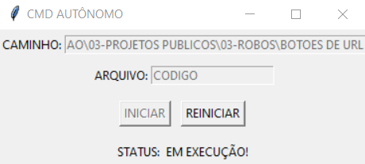

# CMD AUTONOMO
🎈INICIE E REINICIE SEU SCRIPT.PY.

  

## DESCRIÇÃO:
### GERAL:
O CMD AUTÔNOMO é uma aplicação desenvolvida em Python e interface gráfica utilizando a biblioteca Tkinter. Seu propósito principal é permitir que os usuários executem comandos e scripts Python de forma simples e intuitiva, diretamente de uma interface gráfica.

### RECURSOS:
1. **Campos de entrada "CAMINHO" e "ARQUIVO"**: Os usuários podem inserir o caminho do diretório onde o arquivo Python está localizado e o nome do arquivo a ser executado.
2. **Botões de controle**: Os botões "INICIAR", "REINICIAR", "PARAR" e "LIMPAR" oferecem funcionalidades para iniciar, reiniciar, parar a execução do script Python e limpar os campos de entrada, respectivamente.
3. **Status de execução**: Uma área de status exibe informações sobre o estado atual da execução do script, como "PARADO" ou "EM EXECUÇÃO!".
4. **Salvamento automático de configurações**: As configurações de "CAMINHO" e "ARQUIVO" são automaticamente salvas em um arquivo JSON chamado "CONFIG.json" no mesmo diretório do código. Isso permite que as configurações sejam carregadas automaticamente na próxima execução do aplicativo.
5. **Gerenciamento seguro de processos**: O aplicativo utiliza a biblioteca `psutil` para garantir o encerramento seguro do processo Python em execução.

### COMPORTAMENTO DOS CAMPOS E BOTÕES:
1. **Campos "CAMINHO" e "ARQUIVO"**:
   - Os campos estão inicialmente vazios e habilitados para entrada.
   - Quando ambos os campos estão preenchidos, o botão "INICIAR" é habilitado, permitindo ao usuário iniciar a execução do script.
   - O botão "LIMPAR" é habilitado quando ambos os campos estão preenchidos, permitindo ao usuário limpar os campos de entrada.
2. **Botões de controle**:
   - O botão "INICIAR" inicia a execução do script Python, desabilitando os campos de entrada e habilitando os botões "REINICIAR" e "PARAR".
   - O botão "REINICIAR" reinicia a execução do script Python, mantendo os campos de entrada inalterados.
   - O botão "PARAR" interrompe a execução do script Python em andamento, habilitando novamente os campos de entrada e desabilitando os botões "REINICIAR" e "PARAR". Habilitando novamento o botão "LIMPAR".

## PORQUE CRIEI ESSE APP?
- O aplicativo CMD AUTÔNOMO foi desenvolvido para simplificar a execução de bots Python diretamente pelo console, inspirado no conceito do "nodemon", eliminando a necessidade de reinicialização manual após modificações no código.
- Foi criado com o objetivo de proporcionar uma maneira fácil e conveniente de executar comandos e scripts Python através de uma interface gráfica amigável.
- Os usuários podem especificar o caminho do arquivo e o nome do script Python que desejam executar, com a opção de iniciar ou reiniciar a execução do script conforme necessário.

## OBSERVAÇÃO:
1. **Limitações da Ferramenta**:
   - O CMD AUTÔNOMO não substitui um ambiente de desenvolvimento integrado (IDE) ou outras ferramentas mais avançadas para desenvolvimento e execução de código.
   - Não oferece suporte para a execução de comandos complexos do sistema operacional diretamente pelo aplicativo.

2. **Requisitos de Instalação e Configuração**:
   - Os usuários devem ter o Python instalado e configurado corretamente em seus sistemas para que o aplicativo funcione corretamente.

3. **Suporte de Linguagem**:
   - Atualmente, o aplicativo suporta apenas a execução de scripts Python e não oferece suporte para outras linguagens de programação.

## USANDO O APP:
- Para utilizar o CMD AUTÔNOMO, basta fornecer o caminho do arquivo e o nome do script Python que deseja executar. Após preencher esses campos, clique no botão "INICIAR" para iniciar a execução. Se você fizer alguma alteração no seu código, basta clicar em "REINICIAR" para atualizar seu projeto com as novas modificações:
* **LABEL `CAMINHO`:** É um campo de entrada onde você deve inserir o caminho do diretório onde está o script Python.
* **LABEL `ARQUIVO`:** É um campo de entrada onde você deve inserir o nome do arquivo Python.
* **BOTÃO `INICIAR:`** Quando clicado, inicia a execução do script Python especificado.
* **BOTÃO `REINICIAR:`** Quando clicado, reinicia a execução do script Python. Isso primeiro para o processo em execução e então inicia novamente.
* **BOTÃO `PARAR:`** Quando clicado, apenas interrompe a execução do script Python. 
* **BOTÃO `LIMPAR:`** Ao ser clicado, o botão "LIMPAR" tem a função de limpar todos os campos de entrada, fornecendo uma maneira rápida e conveniente de remover dados inseridos anteriormente. É importante observar que essa ação não afeta os dados salvos no arquivo "CONFIG.json", garantindo a preservação das configurações previamente inseridas.

## SOBRE O EXECUTAVEL:
- Este arquivo executável está disponível apenas para `Windows X64`. Para executá-lo, basta dar dois cliques. O executável é bastante útil caso o Python não esteja instalado. Trata-se da mesma aplicação do arquivo `CODIGO.py`. Se desejar, você pode recompilá-lo novamente; é para isso que forneci o arquivo `imagem.ico`.

- É importante explicar que ao executar o arquivo executável deste programa, é possível que o antivírus dispare um alerta de segurança. Isso ocorre porque o programa executa comandos do sistema operacional e pode abrir outros aplicativos ou acessar a rede.

    * Para lidar com isso, há 2 alternativas:

    1. **Adicionar exceção ao antivírus:** Você pode optar por adicionar uma exceção ao antivírus para permitir que o programa execute comandos do sistema sem disparar alertas. Isso geralmente pode ser feito acessando as configurações do antivírus e adicionando o arquivo executável do programa à lista de exceções.

    2. **Executar apenas o `CODIGO.py`:** Uma alternativa é optar por executar apenas o arquivo de código-fonte Python (`CODIGO.py`). Isso evita que o antivírus dispare alertas, já que você e o sistema podem inspecionar o código fonte diretamente.

## NÃO SABE?
- Entendemos que para manipular arquivos em muitas linguagens e tecnologias, é necessário possuir conhecimento nessas áreas. Para auxiliar nesse aprendizado, oferecemos cursos gratuitos disponíveis:
* [CURSO DE PYTHON](https://github.com/VILHALVA/CURSO-DE-PYTHON)
* [CURSO DE TKINTER](https://github.com/VILHALVA/CURSO-DE-TKINTER)
* [CURSO DE EXE](https://github.com/VILHALVA/CURSO-DE-EXE)
* [CONFIRA MAIS CURSOS](https://github.com/VILHALVA?tab=repositories&q=+topic:CURSO)

## CREDITOS:
- [PROJETO CRIADO PELO VILHALVA](https://github.com/VILHALVA)

