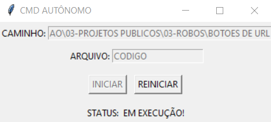

# CMD AUTONOMO
👨‍🏫CMD AUTÔNOMO É UM APP EM PYTHON COM INTERFACE GRÁFICA (CUSTOMTKINTER) PARA EXECUTAR SCRIPTS PYTHON DE FORMA SIMPLES, SEM USAR O TERMINAL.

 <br>

## DESCRIÇÃO:
**CMD AUTÔNOMO** é uma aplicação desenvolvida em Python com interface gráfica utilizando a biblioteca `customtkinter`. Seu objetivo é permitir a execução fácil e visual de scripts Python diretamente a partir de um ambiente gráfico, sem a necessidade de abrir o terminal.

## RECURSOS:
1. **Seleção de arquivos Python**: O usuário pode selecionar qualquer arquivo `.py` do sistema por meio de um botão que abre o explorador de arquivos.

2. **Botões de controle**:
   * **INICIAR**: Executa o script Python selecionado.
   * **PARAR**: Interrompe a execução do script em andamento.
   * **COPIAR**: Copia a saída gerada (stdout) para a área de transferência.
   * **LIMPAR**: Limpa o campo de seleção de arquivo e a área de status.

3. **Área de status**: Exibe a saída do script em tempo real, além de mensagens informativas, avisos e erros.

4. **Log de execução (opcional)**: O usuário pode ativar um modo de log, que salva toda a saída gerada em um arquivo `LOG/CMD AUTONOMO.txt` com data e hora.

5. **Gerenciamento seguro de processos**: Utiliza a biblioteca `psutil` para encerrar processos Python de forma segura, incluindo subprocessos filhos.

## COMPORTAMENTO DOS CAMPOS E BOTÕES:
1. **Campo de seleção de arquivo**:
   * Inicialmente desabilitado para edição direta e vazio.
   * Habilita os botões "INICIAR" e "LIMPAR" após um arquivo válido ser selecionado.

2. **Botões de controle**:
   * **INICIAR**:
     * Inicia a execução do script.
     * Desabilita o botão de seleção de arquivo.
     * Habilita os botões "PARAR" e "COPIAR".
   * **PARAR**:
     * Interrompe a execução do script em andamento.
     * Reabilita o botão de seleção de arquivo.
     * Habilita os botões "INICIAR", "COPIAR" e "LIMPAR".
   * **LIMPAR**:
     * Limpa o campo de seleção de arquivo e a área de status.
     * Desabilita todos os botões, exceto o de seleção de arquivo.
   * **COPIAR**:
     * Copia a saída da execução para a área de transferência.
     * Exibe uma mensagem de confirmação temporária ("TEXTO COPIADO!").

3. **Switch de LOG**:
   * Ao ser ativado, o sistema gera um novo arquivo de log na pasta `LOG`, utilizando a data e hora como parte do nome do arquivo, garantindo registros organizados por sessão.
   * Toda a saída posterior é salva automaticamente nesse arquivo.
   * Pode ser desativado a qualquer momento.

## PORQUE CRIEI ESSE APP?
- O aplicativo `CMD AUTÔNOMO` foi desenvolvido para simplificar a execução de bots Python diretamente pelo console, inspirado no conceito do "nodemon", eliminando a necessidade de reinicialização manual após modificações no código.

## OBSERVAÇÃO:
1. **Limitações da Ferramenta:**
   - O CMD AUTÔNOMO não substitui um ambiente de desenvolvimento integrado (IDE) ou outras ferramentas mais avançadas para desenvolvimento e execução de código.
   - Não oferece suporte para a execução de comandos complexos do sistema operacional diretamente pelo aplicativo.

2. **Requisitos de Instalação e Configuração:**
   - É necessário que o **Python esteja instalado e corretamente configurado** no sistema para que o aplicativo funcione como esperado.
   - Além disso, **todas as dependências do script que será executado devem estar previamente instaladas**. Isso inclui bibliotecas e pacotes utilizados no código Python que você pretende rodar por meio da aplicação.

3. **Suporte de Linguagem:**
   - O aplicativo suporta apenas a execução de scripts Python e não oferece suporte para outras linguagens de programação.

## COMO USAR O APLICATIVO?
1. **Instale as Dependências:**
Antes de iniciar o aplicativo, é necessário instalar as bibliotecas utilizadas no projeto. No terminal, execute:

```bash
pip install -r requirements.txt
```

> 💡 O arquivo `requirements.txt` está localizado dentro da pasta `./CODIGO`.

2. **Executando o Aplicativo:**
   Navegue até o diretório `./CODIGO` e execute o script com o comando:

   ```bash
   python CODIGO.py
   ```

3. **Interface e Funcionalidades:**
Após abrir o aplicativo, utilize os seguintes recursos:

* **Botão `SELECIONAR`:** Abre o explorador de arquivos para escolher um script Python (`.py`) a ser executado.
* **Botão `INICIAR`:** Inicia a execução do script selecionado. Esse botão só é ativado após um arquivo válido ser escolhido.
* **Botão `PARAR`:** Interrompe a execução atual do script Python de forma segura.
* **Botão `COPIAR`:** Copia toda a saída exibida na área de status para a área de transferência.
* **Botão `LIMPAR`:** Limpa o campo de seleção de arquivo e a saída exibida, retornando a aplicação ao estado inicial.
* **Switch `LOG OFF / LOG ON`:** Ao ser ativado, inicia o registro automático de toda a saída gerada durante a execução em um arquivo de log (`CMD AUTONOMO_DATA_HORA.txt`), criado automaticamente na pasta `LOG`.

4. **Campo de Seleção de Arquivo:**
* Exibe o caminho do script Python escolhido.
* Este campo é somente leitura e atualizado automaticamente após a seleção via o botão `SELECIONAR`.
* A escolha de um arquivo válido ativa os botões "INICIAR" e "LIMPAR".

## SOBRE O EXECUTAVEL:
### 1. EXECUTANDO:
- O executável gerado está disponível apenas para sistemas **Windows x64** e pode ser encontrado no diretório `./APP`. Para executá-lo, basta dar dois cliques. O executável é bastante útil caso o Python não esteja instalado. Trata-se da mesma aplicação do arquivo `./CODIGO/CODIGO.py`. Se desejar, você pode recompilá-lo novamente.

- Ao executar o **arquivo executável** deste aplicativo, **é possível que seu antivírus exiba um alerta de segurança**. Isso **não significa que o aplicativo é malicioso**, mas sim que o antivírus está reagindo ao comportamento comum de programas que executam comandos do sistema, como é o caso deste projeto.

   **Para lidar com isso, há 2 alternativas:**

   1. **Adicionar uma exceção no antivírus:**
      - Inclua o arquivo executável do aplicativo na **lista de exclusões (exceções)** do seu antivírus. Esse procedimento pode variar conforme o antivírus utilizado, mas normalmente está disponível nas configurações de segurança, na seção de "Exclusões", "Ameaças permitidas" ou "Pastas confiáveis". Isso permitirá que o aplicativo rode normalmente sem gerar bloqueios ou alertas.

   2. **Executar diretamente o código-fonte (`CODIGO.py`):**
      - Caso prefira uma abordagem mais transparente, você pode simplesmente **executar o script Python original** (`CODIGO.py`) utilizando um ambiente Python instalado na sua máquina. Essa abordagem permite verificar o código antes da execução, e **reduz drasticamente a chance de alertas**, pois o antivírus entende que você está executando um script legítimo de forma explícita.

### 2. GERANDO:
> **IMPORTANTE:** Antes de gerar o novo `executável`, certifique-se de excluir o arquivo `./APP/CMD AUTONOMO.exe`.

   **1. Instalação do [PyInstaller:](https://pyinstaller.org/en/stable/)**
   - Certifique-se de ter o PyInstaller instalado. Se não tiver, instale usando o comando abaixo:
   ```bash
   pip install pyinstaller
   ```

   **2. Gerando o Executável:**
   - No diretório `./CODIGO`, execute o comando abaixo para gerar o executável a partir do arquivo `.spec`:

   ```bash
   pyinstaller EXECUTAVEL.spec
   ```

   - O arquivo `CMD AUTONOMO.exe` será criado dentro da pasta `./CODIGO/dist`.

   - Após a geração, você pode mover o executável para `./APP` e remover as pastas temporárias `./CODIGO/build` e `./CODIGO/dist`.

   - Para executar o aplicativo, basta dar dois cliques no arquivo `.exe`.

## NÃO SABE?
- Entendemos que para manipular arquivos em muitas linguagens e tecnologias, é necessário possuir conhecimento nessas áreas. Para auxiliar nesse aprendizado, oferecemos cursos gratuitos disponíveis:
* [CURSO DE PYTHON](https://github.com/VILHALVA/CURSO-DE-PYTHON)
* [CURSO DE CUSTOMTKINTER](https://github.com/VILHALVA/CURSO-DE-CUSTOMTKINTER)
* [CONFIRA MAIS CURSOS](https://github.com/VILHALVA?tab=repositories&q=+topic:CURSO)

## CREDITOS E MAIS:
- [PROJETO CRIADO PELO VILHALVA](https://github.com/VILHALVA)
- [CLIQUE AQUI PARA VER O HISTÓRICO DE ATUALIZAÇÕES](./UPDATES.md)


